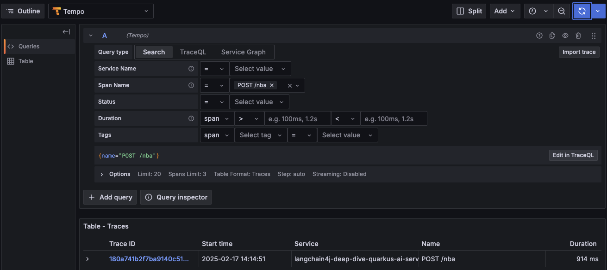
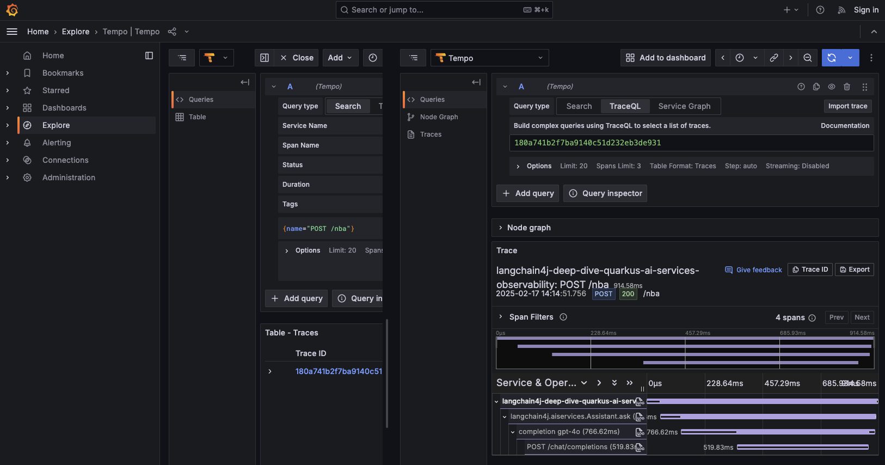

# Function calling - Observability

## Requirements for running this app
By default this app uses OpenAI's gpt-4o model.

You need to set the `OPENAI_API_KEY` environment variable to the value of your OpenAI key.

## Running this app
1. Run `./mvnw clean quarkus:dev`

> [!NOTE]
> It may take a minute or so for the observability stack to start up 

2. Once the app is up, hit the `d` key in the Quarkus console, or open a browser to http://localhost:8080/q/dev-ui/
3. Find the `SmallRye OpenAPI` tile and click the `Swagger UI` link (http://localhost:8080/q/dev-ui/io.quarkus.quarkus-smallrye-openapi/swagger-ui)
4. Expand the `/email-me-a-poem` entry and click `Try it out`
5. Click `Execute`
6. You should see a response in the `Response body` section
7. Return to the Dev UI by clicking the `Dev UI` icon on the top-left of the screen
8. Find the `Observability` tile and click on `Grafana UI`
9. In Grafana, in the left navigation click the `Explore` entry
10. The next view will default to `Prometheus`. Click the drop-down that says `Prometheus` and select `Tempo`
11. In the `Query type` field, select `Search`
12. In the `Span Name` field, click the drop-down that says `Select value` and choose `POST /nba`
13. Click the blue button at the top-right of the screen. You should see a single trace

14. Click on the trace id to display the trace details

15. When done, hit the `q` key in the Quarkus console

## Running with local Ollama instead
If you'd like to run with a local Ollama instance instead, first you need to ensure a local Ollama instance is running on port `11434` and the `llama3.2` model is pulled.

Then you can replace step 1 above with `./mvnw clean quarkus:dev -Dquarkus.profile=ollama,dev`